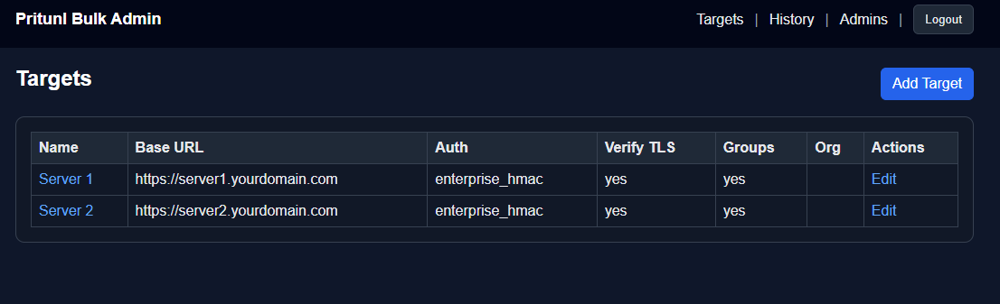
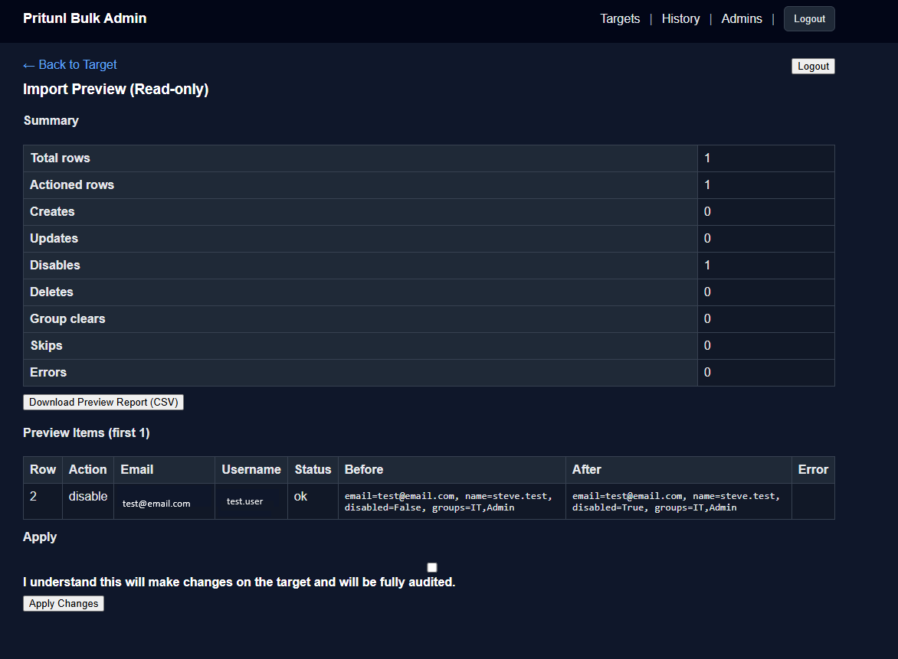
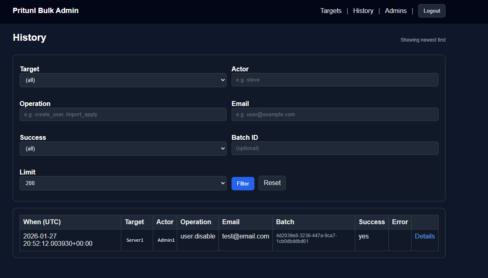
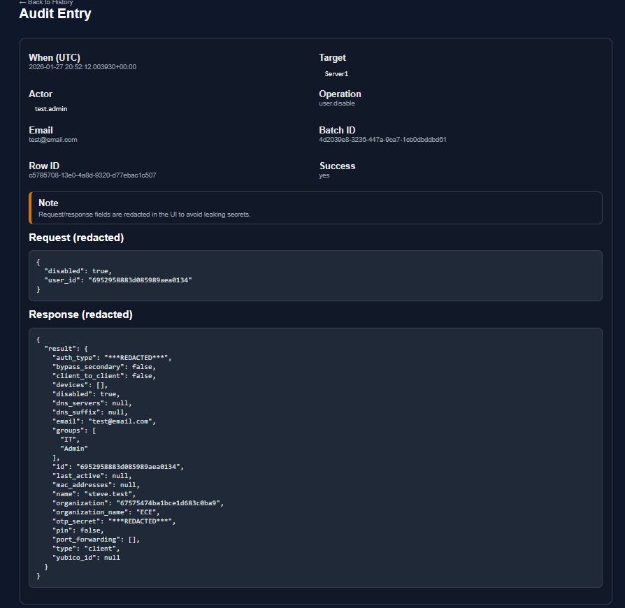

# Pritunl Bulk Admin

A self-hosted web application for **bulk user lifecycle management** across one or more Pritunl VPN servers.

> ✅ **Stable v1.0 — production-ready for internal use**  
> Designed for trusted operations teams managing users at scale across multiple Pritunl environments.

---

## What this is

Pritunl Bulk Admin is an **admin-only management UI** that allows infrastructure and operations teams to safely perform **bulk user operations** against one or more Pritunl servers.

It is designed for environments where:

- Users frequently move between teams, roles, or clients
- Multiple Pritunl servers must be managed consistently
- Manual, UI-driven user administration does not scale
- Change accountability and auditability matter

Core capabilities include:

- Managing **multiple Pritunl targets** (e.g. prod, staging, sandbox)
- Exporting users to CSV
- Importing CSV files to **create, update, disable, or delete users**
- Performing **dry-run previews** before applying changes
- Encrypting Pritunl credentials **at rest**
- Maintaining a complete **audit history** of bulk operations

---

## What this is NOT

- ❌ Not a replacement for the Pritunl admin UI  
- ❌ Not an identity provider (IdP)  
- ❌ Not a general-purpose IAM system  
- ❌ Not exposed to end users  

This tool is intended for **trusted operations and infrastructure administrators only**.

---

## Key Features

### Authentication & Access
- Local admin authentication
  - Password-based login
  - Optional TOTP (2FA)
- Secure first-boot `/setup` flow
  - Requires a one-time setup token
  - Automatically promotes the first admin to **superadmin**
  - Setup routes are permanently disabled after bootstrap

### Pritunl Target Management
- Support for multiple Pritunl servers
- Community Edition
  - Session-based admin authentication
- Enterprise Edition
  - API token authentication
- Target capabilities are detected automatically

### Bulk Operations
- CSV-based import and export
- Row-level actions:
  - `create`
  - `update`
  - `upsert`
  - `disable`
  - `delete`
- Dry-run mode enabled by default
- Explicit confirmation required for destructive changes

### Security & Auditing
- Encrypted storage of Pritunl credentials (AES/Fernet)
- Full audit log of all bulk operations
- Timestamped, immutable history suitable for compliance review

---

## Supported Pritunl Editions

| Edition     | Supported | Notes |
|------------|-----------|------|
| Community  | ✅ Yes     | Session-based admin authentication |
| Enterprise | ✅ Yes     | Official API token support |
| Groups    | ⚠️ Partial | Requires Enterprise edition |

---

## Architecture Overview

- **Backend:** Python / FastAPI
- **Templates:** Jinja2
- **Database:** PostgreSQL
- **Deployment:** Docker Compose
- **Reverse Proxy:** Nginx (TLS termination)

Sensitive credentials are encrypted using a master key supplied at runtime and are never stored in plaintext.

---

## Security Model & Threat Assumptions

This application makes **explicit assumptions** about its operating environment:

- Deployed on an **internal network or VPN**
- Accessible only to a **small number of trusted administrators**
- Not hardened for untrusted or public internet exposure

Security controls include:

- Encrypted credential storage
- Local admin accounts only
- Optional TOTP (RFC 6238)
- One-time bootstrap with setup token
- Automatic superadmin assignment for first admin
- Complete audit logging of bulk actions

> ⚠️ **Important**  
> This tool can create, disable, or delete VPN users in bulk.  
> Administrators are expected to review dry-run previews and audit history before applying changes.

Optional outer protections (network ACLs, VPN access, reverse proxy controls) may be added based on organizational policy.

---

## Intended Deployment Model

- Dedicated Linux VM (Ubuntu recommended)
- Internal network or VPN access only
- Not exposed directly to the public internet
- Managed by a small number of trusted administrators

This tool is intentionally **not multi-tenant** and does not attempt to replace or abstract Pritunl’s native security model.

---

## Screenshots

> Screenshots show example workflows using **test data**.  
> Sensitive values (credentials, tokens, secrets) are redacted.

### Targets overview
Manage multiple Pritunl servers from a single admin interface.

### CSV import preview (dry-run)
Review planned changes before applying them.

### Audit history
View a complete, timestamped history of bulk operations.

### Audit entry details
Inspect individual actions with redacted request/response context.

---

## Installation

See [`deploy/INSTALL.md`](deploy/INSTALL.md) for full deployment and bootstrap instructions.

---

## License

Apache-2.0

Free to use, modify, and distribute.  
Contributions and internal forks are welcome.

---

## Project Status

**v1.0 — Stable for internal production use**

Future work focuses on:
- UX refinements
- Audit visibility improvements
- Additional safety rails around destructive operations
